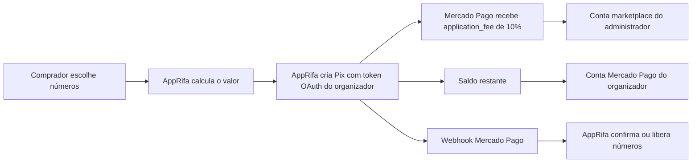

# Plano de integração do AppRifa com o Mercado Pago

Atualizado em 5 de setembro de 2026.

## Objetivo

O AppRifa será operado como um **marketplace com Split de Pagamentos 1:1 do Mercado Pago**.

A conta do administrador não deve ser conectada pelo mesmo OAuth usado pelos organizadores. Segundo o fluxo oficial, a conta do administrador é a conta marketplace/integrador que cria e possui a aplicação Mercado Pago. Cada organizador autoriza sua própria conta de vendedor via OAuth.

O AppRifa cria o pagamento usando o Access Token OAuth do organizador e informa o valor da comissão no parâmetro `application_fee`. O Mercado Pago direciona essa comissão à conta marketplace vinculada à aplicação.

Referência oficial: [Integrar o checkout em Split de Pagamentos 1:1](https://www.mercadopago.com.br/developers/pt/docs/split-payments/split-1-1/integration-configuration/integrate-marketplace).

## Divisão financeira

Em uma cobrança de R$ 100,00:

| Destino | Cálculo |
|---|---:|
| Comissão AppRifa | R$ 10,00 em `application_fee` |
| Mercado Pago | Tarifa própria do processamento |
| Organizador | R$ 100,00 menos R$ 10,00 e menos a tarifa do Mercado Pago |

O organizador não recebe necessariamente R$ 90,00 líquidos. A documentação informa que a tarifa do Mercado Pago é descontada do vendedor e, depois, a comissão do marketplace é descontada do valor restante.

## Fluxo geral



## 1. Corrigir a aba Mercado Pago da administração

A implementação atual da `gestao.html` será revisada. A aba não deverá cadastrar ou gerenciar contas de compradores, vendedores ou contas pertencentes aos clientes.

Ela será transformada em **Configuração do Marketplace Mercado Pago** e apresentará:

- Identificação da conta marketplace/integrador.
- Situação da aplicação Mercado Pago.
- App ID mascarado.
- Situação das credenciais.
- Situação da chave de criptografia.
- URL OAuth configurada.
- URL do webhook configurada.
- Percentual da plataforma, fixado inicialmente em 10%.
- Estado do webhook.
- Estado geral da homologação.
- Consulta das comissões e conciliação por relatório, em etapa posterior.

Os segredos não serão exibidos pelo navegador. Client Secret, Access Token da plataforma e Webhook Secret permanecerão no backend, por variável protegida ou armazenamento criptografado.

O botão administrativo não será “conectar conta de cliente”. Será algo como **Verificar configuração do marketplace**, pois a conta do administrador será a proprietária da aplicação Mercado Pago.

## 2. Configurar a conta marketplace do administrador

Na conta Mercado Pago da plataforma deverão ser realizados os passos oficiais:

- Criar ou ajustar uma aplicação para **Split de Pagamentos 1:1**.
- Confirmar que a conta cumpre os requisitos do Mercado Pago, incluindo o nível de identificação solicitado.
- Obter App ID, Client Secret, Public Key e credenciais necessárias.
- Cadastrar a URL de redirecionamento OAuth.
- Cadastrar a URL de webhook e gerar a assinatura secreta.
- Confirmar a habilitação comercial do Split 1:1 para a aplicação.

URLs planejadas:

```text
OAuth:
https://app.sanesul.ms.gov.br/api/payments/mercadopago/connect/callback

Webhook:
https://app.sanesul.ms.gov.br/api/webhooks/mercadopago?source_news=webhooks
```

A documentação lista como pré-requisitos uma conta Mercado Pago identificada, uma aplicação Mercado Pago e a autorização OAuth dos vendedores.

Referência oficial: [Pré-requisitos do Split de Pagamentos 1:1](https://www.mercadopago.com.br/developers/pt/docs/split-payments/split-1-1/prerequisites).

## 3. Manter a conexão do organizador via OAuth

Na área do organizador permanecerá a aba **Conectar conta Mercado Pago**.

O fluxo será:

1. O organizador clica em conectar.
2. O AppRifa cria um `state` seguro associado ao tenant.
3. O navegador é redirecionado ao Mercado Pago.
4. O organizador entra na própria conta Mercado Pago e autoriza o AppRifa.
5. O Mercado Pago retorna um código temporário.
6. O backend troca o código por `access_token` e `refresh_token`.
7. Os tokens são criptografados e vinculados somente ao tenant correspondente.
8. O painel passa a mostrar a conta como conectada.

Será acrescentado PKCE, recomendado pela documentação oficial, além de `state` persistido, aleatório, de uso único e com expiração. O código OAuth tem validade curta e não deverá ser reutilizado.

Referência oficial: [OAuth do Mercado Pago](https://www.mercadopago.com.br/developers/pt/docs/security/oauth/creation).

O organizador não informará senha, código de verificação ou Access Token dentro do AppRifa. Esses dados serão tratados somente na página oficial de autorização do Mercado Pago.

## 4. Criar o Pix usando a conta do organizador

O AppRifa continuará usando Checkout Transparente com `POST /v1/payments`, que é o fluxo documentado para o parâmetro `application_fee`.

Para cada compra:

- O backend consulta a rifa e os números.
- Aplica o desconto comercial existente.
- Calcula o valor final cobrado.
- Calcula `application_fee = valor_final × 10%`.
- Salva pagamento, números, referência e chave idempotente localmente.
- Obtém o token OAuth do organizador.
- Cria o pagamento usando esse token.
- Envia `payment_method_id: pix`.
- Envia CPF/CNPJ, e-mail, nome e sobrenome do comprador.
- Envia a expiração do Pix.
- Envia `external_reference`.
- Envia `notification_url`.
- Envia `application_fee` como valor monetário.
- Armazena ID externo, QR Code, Pix copia e cola e `ticket_url`.

Exemplo conceitual para uma cobrança de R$ 27,00:

```json
{
  "transaction_amount": 27,
  "payment_method_id": "pix",
  "application_fee": 2.70,
  "external_reference": "apprifa-tenant-pagamento",
  "payer": {
    "email": "comprador@exemplo.com",
    "first_name": "Nome",
    "last_name": "Sobrenome",
    "identification": {
      "type": "CPF",
      "number": "00000000000"
    }
  }
}
```

A chave `X-Idempotency-Key` será obrigatória e reutilizada nas retentativas da mesma compra.

Referência oficial: [Pix pela Payments API](https://www.mercadopago.com.br/developers/pt/docs/checkout-bricks/payment-brick/payment-submission/pix).

## 5. Tratar corretamente a comissão de 10%

O percentual será uma regra da plataforma. O banco armazenará, por pagamento:

- Valor bruto cobrado.
- Percentual aplicado.
- Valor da comissão solicitado.
- ID do organizador.
- ID da conta Mercado Pago do organizador.
- ID do pagamento externo.
- Estado da cobrança.
- Estado da conciliação.

O valor da comissão será congelado no momento da criação do pagamento. Uma alteração futura no percentual não poderá modificar pagamentos antigos.

O AppRifa verificará que:

```text
application_fee = valor realmente cobrado × 10%
```

Se uma compra de três números custar R$ 30,00 e tiver desconto de R$ 3,00, a comissão será R$ 2,70, calculada sobre R$ 27,00.

## 6. Adequar o webhook

O webhook terá estas responsabilidades:

- Receber o corpo original da notificação.
- Extrair `data.id`, `x-request-id`, `ts` e `v1`.
- Validar a assinatura usando o Webhook Secret.
- Validar também a idade do timestamp para reduzir repetição de notificações antigas.
- Localizar o pagamento pelo ID externo.
- Buscar o pagamento diretamente na API do Mercado Pago usando o token do vendedor associado.
- Confirmar valor, moeda BRL, método Pix, referência externa e conta recebedora.
- Processar notificações repetidas sem duplicar ações.
- Confirmar os números somente quando o pagamento estiver aprovado.
- Liberar a reserva somente após estado conclusivo de cancelamento ou recusa.
- Preservar a reserva em falhas temporárias ou respostas inconclusivas.
- Registrar eventos processados para auditoria.

A URL enviada ao criar o pagamento tem prioridade sobre a URL configurada no painel Mercado Pago. A assinatura usa o manifesto composto por ID, request ID e timestamp.

Referência oficial: [Webhooks do Mercado Pago](https://www.mercadopago.com.br/developers/pt/docs/your-integrations/notifications/webhooks).

## 7. Tratar cancelamentos, estornos e disputas

O plano incluirá estados distintos para:

- Pix pendente.
- Pix aprovado.
- Pix recusado.
- Pix cancelado ou expirado.
- Pagamento reembolsado.
- Pagamento contestado.
- Pagamento estornado.

Um pagamento aprovado não poderá voltar para pendente por causa de uma notificação antiga.

Em reembolsos, o Mercado Pago divide o débito proporcionalmente entre vendedor e marketplace. A documentação também informa que o reembolso total pode depender de saldo suficiente nas partes envolvidas. Isso exigirá uma rotina administrativa específica e registro de auditoria.

## 8. Adicionar conciliação financeira

Além do webhook, uma rotina periódica consultará pagamentos pendentes e casos com falha de comunicação.

A administração terá uma visão com:

- Total cobrado.
- Comissão AppRifa solicitada.
- Taxa Mercado Pago.
- Valor líquido do organizador.
- Situação da comissão.
- Pagamentos sem conciliação.
- Reembolsos e contestações.

O Mercado Pago oferece relatório próprio de vendas com split contendo valor da transação, tarifa do marketplace, tarifa do Mercado Pago e valor líquido recebido. Esse relatório será a fonte de confirmação financeira, e não apenas o campo enviado na criação do pagamento.

Referência oficial: [Relatório de vendas com split](https://www.mercadopago.com.br/developers/pt/docs/reports/sales-report/introduction).

## 9. Separar homologação de produção

Serão usados ambientes e dados distintos:

- Banco de homologação.
- Contas brasileiras de teste.
- Credenciais de teste.
- URLs públicas HTTPS.
- Chaves idempotentes exclusivas.
- Evidências sem tokens, senhas ou dados pessoais.

Os testes deverão comprovar:

- OAuth de dois organizadores diferentes.
- Isolamento dos tokens por tenant.
- Criação do Pix pela Payments API.
- Comissão de 10%.
- Mesmo pagamento em retentativas.
- QR Code, copia e cola e link.
- Aprovação, recusa, cancelamento e expiração.
- Webhook válido, inválido e duplicado.
- Renovação do token OAuth.
- Conciliação sem webhook.
- Reembolso e impacto nas duas contas.
- Comissão efetivamente registrada na conta marketplace.

O teste anterior feito com `/v1/orders` comprova somente que o token de teste criou e processou uma order Pix. Ele não homologa o checkout atual, que usa `/v1/payments`, nem comprova o Split 1:1.

## 10. Publicar com possibilidade de retorno

Antes da publicação:

- Fazer backup do banco.
- Preservar a imagem Docker anterior.
- Preservar a chave de criptografia dos tokens.
- Executar migrations versionadas.
- Rodar testes gerais e testes Mercado Pago.
- Validar `docker compose config`.
- Não remover volumes.

A publicação será feita inicialmente com o gateway ainda desabilitado para compradores. Depois da homologação completa, `PAYMENT_PROVIDER` será alterado para `mercadopago` e o container será reconstruído.

Se houver falha, o rollback usará a imagem anterior mantendo banco e volumes. A mesma chave de criptografia deverá permanecer disponível, pois os tokens OAuth cifrados dependem dela.

## Mudança necessária em relação à implementação atual

A gestão das contas de teste dos clientes e o seletor para conectar contas vendedoras serão removidos da administração global.

A `gestao.html` passará a configurar e acompanhar somente a conta marketplace da plataforma e suas comissões. Cada conta de organizador continuará sendo conectada exclusivamente no perfil daquele organizador via OAuth.

## Referências oficiais

- [Visão geral do Split de Pagamentos 1:1](https://www.mercadopago.com.br/developers/pt/docs/split-payments/split-1-1/overview)
- [Pré-requisitos do Split 1:1](https://www.mercadopago.com.br/developers/pt/docs/split-payments/split-1-1/prerequisites)
- [Criar configuração do marketplace](https://www.mercadopago.com.br/developers/pt/docs/split-payments/split-1-1/integration-configuration/create-configuration)
- [Integrar checkout e comissão](https://www.mercadopago.com.br/developers/pt/docs/split-payments/split-1-1/integration-configuration/integrate-marketplace)
- [OAuth do Mercado Pago](https://www.mercadopago.com.br/developers/pt/docs/security/oauth/creation)
- [Pix pela Payments API](https://www.mercadopago.com.br/developers/pt/docs/checkout-bricks/payment-brick/payment-submission/pix)
- [Webhooks](https://www.mercadopago.com.br/developers/pt/docs/your-integrations/notifications/webhooks)
- [Relatório de vendas com split](https://www.mercadopago.com.br/developers/pt/docs/reports/sales-report/introduction)
- [Campos do relatório de split](https://www.mercadopago.com.br/developers/pt/docs/split-payments/additional-content/reports/sales-report/report-fields)
